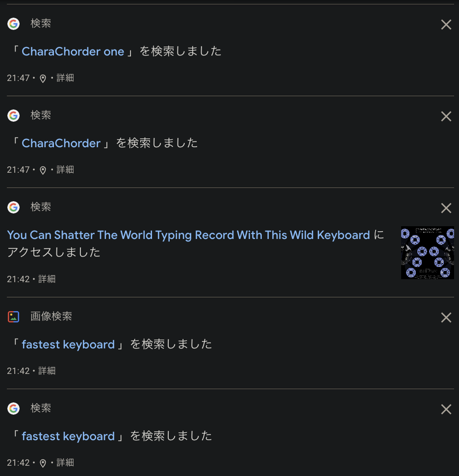
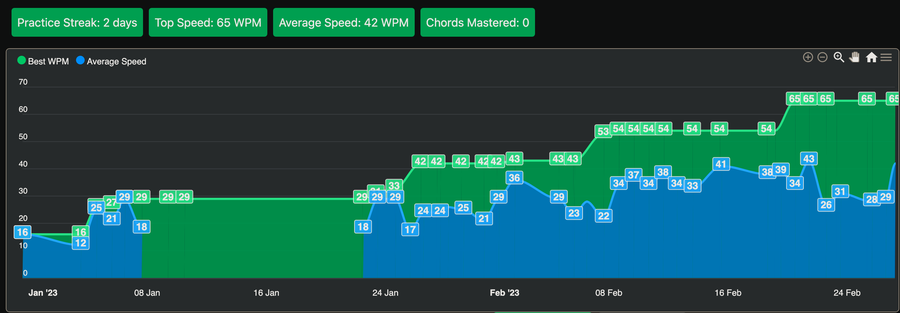
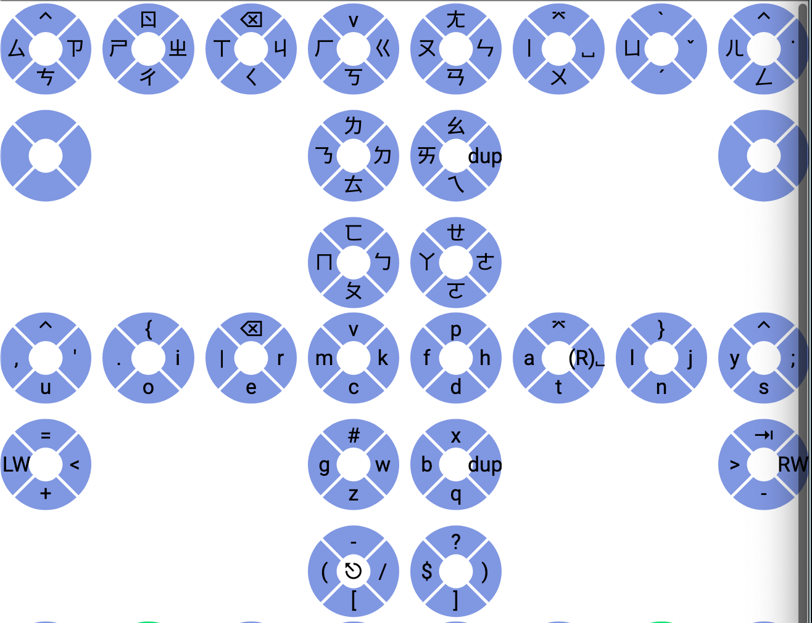

# Tangent's Tough Road to Say Goodbye to QWERTY

## Chapter 1. Encounter - How I Meet CC1

Last year some pain occurred sometimes on my index fingers and wrists, and I found out the main problem was the keyboard. I have relatively small hands so I need to move my entire hand to type on a normal keyboard, and keys are hit mostly by my index fingers. It's nearly impossible to change these 20+ years of bad typing habits, so I thought a possible way is changing the keyboard! I did some searches such as `no hand keyboard`, and `carpal tunnel keyboard` at that time, and I found the **One** with the keyword `fastest keyboard` at a news site.

(Of course, I don't remember this now but google remembers it forever...) I did some search about CC1 and purchased it the next day! (2022/07/22, Order #1195)

## Chapter 2. Dilemma - Training or Using?

I received CC1 about two months later (2022/09/13) and started practicing when off-work. Practicing chentry and chord on CC1 is just like enjoying a relaxing finger exercise. It really helps me reduce the finger and mental fatigue caused by typing and programming when working as a software engineer. My typing speed on CC1 slowly grew higher at this time, and I tried to use CC1 at work a few times because I know there is a huge gap between practicing and using it. But I was interrupted by lots of emergency tasks to do at that time so I could not help but switched back to QWERTY when speed is required. Furthermore, I also need to practice programming and typing my native language on CC1. Both are different from pure English typing. Nice, I really chose a really tough road. But my hands will finally get broken by QWERTY if I give up! I still want to write more useful and interesting programs! With this determined mind and lots of practicing, despite lots of tasks and lots of bad things happening at that time, I reached 40 WPM (English typing) this February, learned a layout (Zhuyin Eten, which keys are highly linked to English key so they are easier to memorize) for my language, and started to write some small piece of the program with CC1. The time with full CC1 is coming?

## Chapter 3. Breakdown - Sudden Death and New Comer

When everything seems to be fine, I accidentally broke a switch on CC1, (I strongly think I have a curse for breaking any electrical things around me.) so I ordered another CC1. (Order #2935, 2023/02/27) The second CC1 was delivered after 10 days. (2023/03/09) Improving from 2 months to 10 days, wow! The bag changed a little bit and I felt the switch is much stronger and easier to use than the old one. The product and the company are growing! These 10 days without practicing surely caused a drop in my speed at first, but it grew back quickly. 

## Chapter 4. Improvement - Keep Thinking, Keep Trying, Keep Refining

During those 10 days, I kept thinking about if there is any improvement space to the layout for my language since the English typing and programming were enough for use. (Of course, speed is still much slower than on QWERTY, 20+ years of muscle memory is as hard as a diamond.) Before that I had already known that my input method, Zhuyin, is possible to chord if the 41 symbols are distributed in different keys (Need to use some number keys with Zhuyin Eten, so it's not an option, but it is still an easier solution although the layout isn't optimized.), so the problems are "How to distribute 41 char keys on CC1 A1 layer with fewer changes to alphabet keys and non-char keys?" and "How to change the mapping between char and Zhuyin symbol of input method?" At first, as a trivial idea, I used 1~9 to replace some non-char keys in the A1 layer. But later, concerning the use case of programming, I moved some frequently used chars in programming instead. As a result, I got this layout.

(Below is the remapped layout and above is the corresponding Zhuyin layout. Pinky and arrow switches are unmodified so they are not rendered. )

For the second problem, I found an open-sourced Zhuyin input method, so today I just changed the mapping according to the layout image and everything has worked well. Time to write a training website for this Zhuyin layout next!

TO BE CONTINUED...
